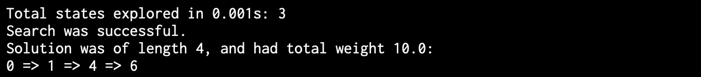
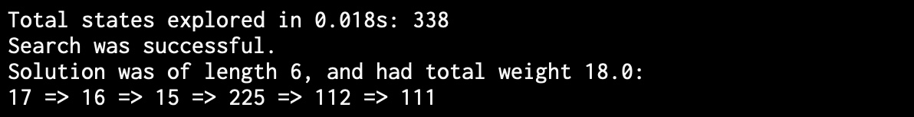
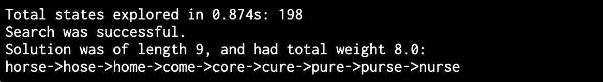
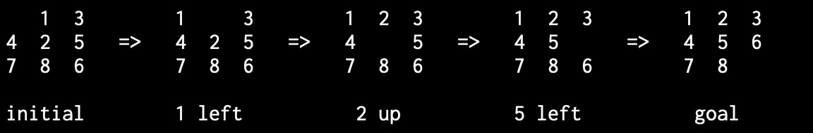

# AStarSolver

## Introduction 

This is an artificial intelligence program that can solve arbitrary state space traversal problems. Specifically, given a graph of possible states, it will find the optimal route from the start state to a goal state.

This AI can be used for a wide variety of problems, including finding driving directions, solving a 15 puzzle, and finding word ladders!

All of this is done by using the A* algorithm!

## Example Solutions

Here are different solutions depending on the problem given: 

Shortest Path

Integer Hop Puzzle

Word Ladder Puzzle

Sliding Puzzle

